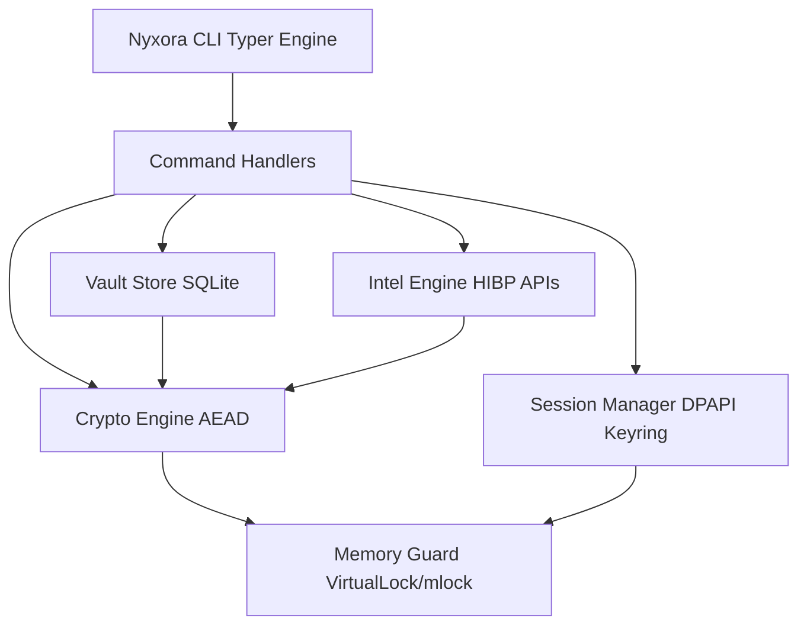

<div align="center">

# 🌌 NYXORA

<p><b>Terminal-Native, Zero-Knowledge, Quantum-Resilient Password Intelligence Vault</b></p>

  
  
  

```text
  ░███    ░██ ░██     ░██ ░██    ░██   ░██████   ░█████████  ░██████   ░███    
  ░████   ░██  ░██   ░██   ░██  ░██   ░██   ░██  ░██     ░██   ░██    ░██░██   
  ░██░██  ░██   ░██ ░██     ░██░██   ░██     ░██ ░██     ░██   ░██   ░██  ░██  
  ░██ ░██ ░██    ░████       ░███    ░██     ░██ ░█████████    ░██  ░█████████ 
  ░██  ░██░██     ░██       ░██░██   ░██     ░██ ░██   ░██     ░██  ░██    ░██ 
  ░██   ░████     ░██      ░██  ░██   ░██   ░██  ░██    ░██    ░██  ░██    ░██ 
 ░██    ░███     ░██     ░██    ░██   ░██████   ░██     ░██ ░██████░██    ░██
  [ O F F L I N E ] • [ Z E R O  K N O W L E D G E ] • [ C Y B E R P U N K ]
```

*Designed and engineered by [ScorpioCodeX](https://github.com/scorpiocodex)*

</div>

---

**Nyxora** is a completely offline, ultra-hardened, command-line password manager. Built for power users, hackers, and security engineers who demand absolute control over their digital sovereignty. Keep your secrets out of the cloud and natively embedded in a high-octane cyberpunk terminal interface.

No telemetry. No forced syncs. Just pure, mathematically resilient cryptographic storage.

## 🛡️ Core Capabilities

🌟 **Quantum-Resistant Foundations**
Encrypts your local vault using memory-hard `Argon2id` for master key derivation, combined with `XChaCha20-Poly1305` authenticated encryption. It actively protects your keys from physical RAM attacks using native OS memory locking (`VirtualLock` on Windows, `mlock` on Linux).

🌟 **Zero-Knowledge Architecture**
Operates in a pure offline environment. The only outbound connection made is an optional lookup against the HaveIBeenPwned API utilizing k-anonymity (meaning only the first 5 characters of a hashed password leave your machine) for breach detection.

🌟 **Cryptographic Recovery**
Includes built-in support for Shamir's Secret Sharing (split the master key into multiple shards) and encrypted emergency recovery capsules to prevent catastrophic data loss.

🌟 **Intel & Audit Engine**
Provides deep pattern analysis and password strength auditing. Nyxora detects keyboard walks, repeated characters, common word bases, leet speak mappings, and password reuse across your entire local vault.

## 🚀 Installation 

`Nyxora` isn't hosted on typical package indexes like PyPI to maintain strict, verifiable source derivation. You can install it directly from this GitHub repository using Python standards.

### Option 1: Using pipx (Recommended)
`pipx` ensures Nyxora is installed in an isolated environment but heavily available globally assigned to your `PATH`.

```bash
pipx install git+https://github.com/scorpiocodex/Nyxora.git
```

### Option 2: Using pip (Global or Virtual Environment)
```bash
python -m pip install git+https://github.com/scorpiocodex/Nyxora.git
```

### Option 3: Local Clone Development
```bash
git clone https://github.com/scorpiocodex/Nyxora.git
cd Nyxora
python -m pip install -e .
```

---

## ⚡ Quick Start

Experience next-generation CLI speed natively inside your terminal.

```bash
# 1. Initialize your new encrypted vault infrastructure
nyx vault init

# 2. Unlock and start a secured memory DPAPI keychain session
nyx vault unlock

# 3. Add a secret with auto-generation parameters
nyx secret add --generate -t "GitHub" -u "cyber-ninja"

# 4. Search and securely push the password to your clipboard
nyx secret get "GitHub" --copy
```

---

## 📚 Global Command Hierarchy

Nyxora organizes its massive array of tools into clear, structured sub-modules. Type `nyx --help` or `nyx <module> --help` to explore the beautifully-rendered terminal graphics describing each endpoint parameter.

### 🔑 Vault & Sessions
* `nyx vault init` : Create the master SQLite database wrapper.
* `nyx vault unlock` : Boot a localized secure vault session.
* `nyx vault lock` : Securely halt background threads and terminate key mappings.
* `nyx vault status` : View cryptographic limits, session timers, and configurations.
* `nyx vault change-password` : Dynamically rotate the master derivation key sequence.
* `nyx vault panic` : **Emergency Protocol**. Rapidly purge all RAM limits and shell bindings immediately.

### 🔒 Secrets Engine
* `nyx secret add` : Inject a new database item with associated URIs, notes, and tags.
* `nyx secret get` : Securely retrieve existing entries and copy to local clipboards.
* `nyx secret list` / `nyx secret search` : Iterate natively over large indexes safely visually.
* `nyx secret update` / `nyx secret delete` : Easily manage and alter components.

### ⚡ Generators & Tools
* `nyx generate password` : Emit highly entropic true-random sequences.
* `nyx generate passphrase` : Assemble multi-word combinations referencing robust EFF lists.
* `nyx generate ssh-key` : Deploy native RSA/ED25519 payload creation (optionally encrypted).

### 🛡️ Security & Intelligence
* `nyx security audit` : Conduct a full vault scan for hash repetitions and structural entropy scores.
* `nyx security hibp` : K-Anonymity hash validation against breach databases.
* `nyx security log` : Cryptographically protected audit history tracing.

### 💾 Resiliency & Backups
* `nyx backup create` : Output `.nyx.bak` local vault snapshot copies.
* `nyx backup restore` / `nyx backup verify` : Assure disk-level stability and rollback support.
* `nyx backup export` : Dump vault items utilizing highly encrypted JSON constraints.

### 🚑 Emergency Access
* `nyx recovery setup-totp` : Deploy RFC-6238 Time-Based OTP secondary locks.
* `nyx recovery capsule` : Seal offline break-glass root keys.
* `nyx recovery split` / `nyx recovery combine` : Execute GF(256) Lagrange interpolation mathematics to split vault constraints into physical Shamir fragments.

### 📁 File Locker
* `nyx locker encrypt` / `nyx locker decrypt` : Bind arbitrary large files (`.pdf`, `.jpg`, `.txt`, `.mp4`) directly into strict encryption boundaries shielded by the vault's derived XChaCha keys.

---

## 🏗️ Execution Architecture



---

<div align="center">
  <sub><b>Nyxora CLI</b> ◦ Developed by ScorpioCodeX ◦ Under MIT License</sub>
</div>
