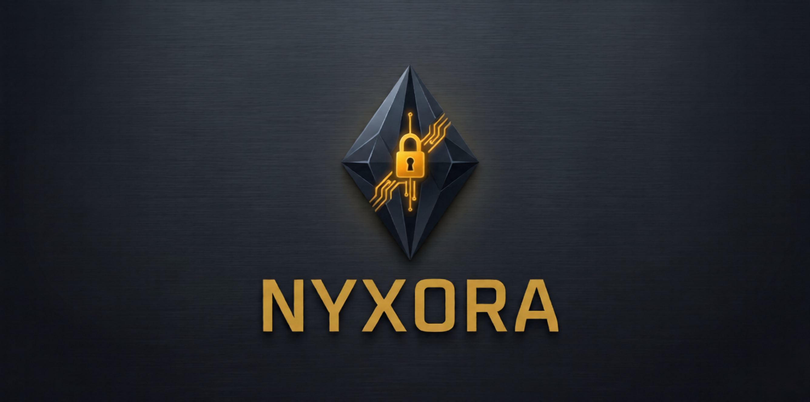
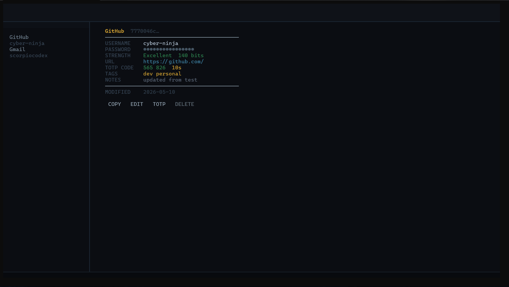

<div align="center">
  

  <p><strong>Your passwords. Your machine. No cloud. No compromise.</strong></p>

  <p>
    <a href="https://pypi.org/project/nyxora/"></a>
    
    
    
    
    
  </p>
</div>

---

Nyxora is an offline password manager that runs entirely in your terminal.
Your vault is stored on your machine, encrypted with military-grade cryptography —
nothing ever leaves it. No accounts. No cloud. No subscriptions.

---

## Preview



*`nyx tui` — interactive vault browser with live TOTP codes, strength ratings, and instant search*

---

## Install

**Recommended — works on Windows and Linux:**

```bash
pipx install nyxora
```

**Standard pip:**

```bash
pip install nyxora
```

**Windows — no Python required:**

Download `nyx.exe` from the [latest release](https://github.com/scorpiocodex/Nyxora/releases/latest)
and run it from any terminal.

---

## Quick Start

```bash
# 1. Create your vault (one time only)
nyx vault init

# 2. Unlock it
nyx vault unlock

# 3. Add a password
nyx secret add -t "GitHub" -u "your-username" --generate

# 4. Open the interactive browser
nyx tui
```

That's it. Your vault is encrypted and stored locally at `~/.nyxora/vault.nyx`.

---

## What can Nyxora do?

| | |
|---|---|
| 🔒 **Store secrets** | Passwords, usernames, URLs, notes, custom fields — all encrypted |
| 🖥️ **Interactive TUI** | Visual vault browser with search, TOTP codes, and strength ratings |
| 🛡️ **Security audit** | Scan for weak, reused, or breached passwords (via HaveIBeenPwned) |
| 📋 **Clipboard** | Copy passwords to clipboard — auto-clears after 30 seconds |
| 🔑 **Generator** | Passwords, passphrases, API keys, SSH keys with entropy analysis |
| 🔐 **TOTP support** | Store 2FA secrets per entry — live codes shown in the TUI and CLI |
| 📦 **Import** | Bring in passwords from Bitwarden, 1Password, or any CSV export |
| 🔌 **Scripting** | Pipe credentials into scripts without exposing them in shell history |
| 🐍 **Python SDK** | `from nyxora import VaultClient` — programmatic vault access |
| 💾 **Backups** | Create, verify, and restore encrypted vault backups |
| 🚨 **Emergency access** | Recovery capsules and Shamir secret sharing for catastrophic scenarios |

---

## Commands

### Vault

```bash
nyx vault init              # create a new vault
nyx vault unlock            # unlock your vault
nyx vault lock              # lock and wipe session
nyx vault status            # show vault status
nyx vault change-password   # change master password
nyx vault panic             # emergency wipe — destroys session immediately
nyx vault profiles          # manage multiple vaults
nyx vault import            # import from CSV, JSON, Bitwarden, or 1Password
```

### Secrets

```bash
nyx secret add              # add a new entry
nyx secret list             # list all entries
nyx secret get "GitHub"     # get an entry by title
nyx secret get "GitHub" --copy   # copy password to clipboard
nyx secret update "GitHub"  # update an entry
nyx secret delete "GitHub"  # delete an entry
nyx secret totp "GitHub"    # show live TOTP code
nyx secret clone "GitHub"   # duplicate an entry
nyx secret search "git"     # search by title, username, or URL
```

### Generate

```bash
nyx generate password                        # random password
nyx generate password --length 32            # custom length
nyx generate password --min-strength strong  # enforce strength
nyx generate passphrase --words 6            # diceware passphrase
nyx generate api-key --prefix NYX            # API key with prefix
nyx generate entropy "hunter2"              # analyse any password
```

### Security

```bash
nyx security audit          # full vault audit
nyx security audit --no-hibp    # skip breach check
nyx security health         # vault health score (0–100)
nyx security due            # passwords overdue for rotation
nyx security log            # audit event history
nyx security forensic       # full integrity verification
```

### Scripting

```bash
# Pipe a password to a command's stdin
nyx script pipe "GitHub" -- some-command

# Inject credentials as environment variables
nyx script run "AWS" -- aws s3 ls

# Fuzzy-find entries (requires fzf)
nyx script fzf --copy

# Machine-readable output
nyx --json secret list
nyx --json vault status
```

### Other

```bash
nyx backup create / list / verify / restore   # vault backups
nyx locker encrypt <file>                     # encrypt any file
nyx recovery status                           # check recovery setup
nyx update check / install / rollback         # manage updates
nyx tui                                       # interactive browser
```

---

## Security

Nyxora is designed to keep your passwords secure even if your machine is compromised:

- **Argon2id** key derivation — memory-hard, resistant to brute force
- **XChaCha20-Poly1305** encryption — authenticated, tamper-evident
- **Per-entry HMAC** integrity checks — detects any modification
- **Memory locking** — prevents keys from being swapped to disk
- **Zero plaintext on disk** — every field is encrypted before storage
- **Offline by default** — no network access except optional HIBP breach checks

Read [SECURITY.md](SECURITY.md) for the full security policy and responsible disclosure process.

---

## Python SDK

```python
from nyxora import VaultClient

with VaultClient(vault_path="~/.nyxora/vault.nyx",
                 password="your-master-password") as client:
    entry = client.get("GitHub")
    print(entry.password)

    totp_code = client.get_totp("GitHub")
    score = client.health()
    print(f"Vault health: {score.grade} ({score.total}/100)")
```

---

## Requirements

- Python 3.12 or later (not needed for Windows `.exe`)
- Windows 10+ or Linux
- macOS — works but not officially tested

---

## Contributing

Pull requests are welcome. See [CONTRIBUTING.md](CONTRIBUTING.md) for guidelines.

---

<div align="center">
  <sub>
    Built by <a href="https://github.com/scorpiocodex">ScorpioCodeX</a> ·
    <a href="https://github.com/scorpiocodex/Nyxora/releases">Releases</a> ·
    <a href="CHANGELOG.md">Changelog</a> ·
    MIT License
  </sub>
</div>
